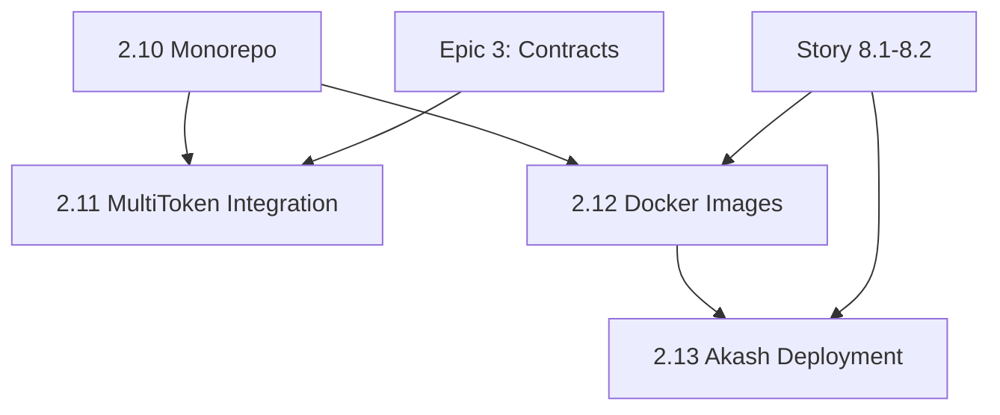

# Epic 2 Update Summary - Dassie Monorepo Integration

**Date:** 2025-12-11
**Author:** Sarah (Product Owner)
**Status:** Ready for Development

---

## Overview

Epic 2 has been updated with **4 new stories** (2.10-2.13) to address the architectural gap discovered during Story 8.3 (Akash mainnet deployment): **Dassie is not yet integrated with the nostream-ilp codebase.**

## Problem Statement

During Epic 8 (Akash deployment), it was discovered that:

1. ❌ **Dassie code is in a separate repository** (`/Users/jonathangreen/Documents/dassie`)
2. ❌ **No Docker image for Dassie** exists
3. ❌ **MultiTokenPaymentChannelFactory contract** (deployed in Epic 3) is not integrated with Dassie
4. ❌ **Akash SDL** only deploys Nostream, not Dassie (missing payment verification)

## Solution: Monorepo Architecture

The solution is to **migrate Dassie into the nostream-ilp repository** as a monorepo using pnpm workspaces, then integrate and deploy.

---

## New Stories Created

### Story 2.10: Migrate Dassie into Monorepo ✅

**File:** `docs/stories/2.10-migrate-dassie-monorepo.md`
**Priority:** HIGH (Foundation)
**Estimated:** 5 days

**Summary:**
- Create pnpm workspace with `packages/` structure
- Move current code to `packages/app-nostream/`
- Copy Dassie to `packages/app-dassie/`
- Extract shared types to `packages/lib-payment-types/`
- Move contracts to `packages/lib-contracts/`
- Configure TypeScript project references
- Update build/dev scripts
- All tests pass in new structure

**Benefits:**
- Single source of truth
- Atomic commits across both services
- Shared TypeScript types (automatic tRPC sync)
- Simplified deployment

---

### Story 2.11: Integrate MultiTokenPaymentChannelFactory ✅

**File:** `docs/stories/2.11-integrate-multitokenpaymentchannel.md`
**Priority:** HIGH (Critical)
**Estimated:** 5 days

**Summary:**
- Create Base L2 settlement module in Dassie
- Create Cronos settlement module in Dassie
- Implement `openChannel`, `verifyClaim`, `closeChannel` using viem
- Add `verifyPaymentClaim` RPC endpoint
- Integration tests with deployed contracts
- Support for ETH and ERC-20 tokens

**Contract Addresses:**
- Cronos Mainnet: `0x9Ec2d217b14e67cAbF86F20F4E7462D6d7bc7684`
- Cronos Testnet: `0x4b9e32389896C05A4CAfC41bE9dA6bB108a7dA72`
- Base Sepolia: TBD
- Base Mainnet: TBD

---

### Story 2.12: Create Docker Images ✅

**File:** `docs/stories/2.12-create-docker-images.md`
**Priority:** HIGH (Required for deployment)
**Estimated:** 3 days

**Summary:**
- Create `docker/Dockerfile.nostream` (multi-stage build)
- Create `docker/Dockerfile.dassie` (multi-stage build)
- Update `docker-compose.yml` with both services
- Configure service discovery (ws://dassie:7768)
- Add health checks
- Optimize images (<500MB each)
- Test inter-service communication

**Architecture:**
```
nostream:8008 → dassie:7768 (WebSocket RPC)
             → postgres:5432
             → redis:6379
```

---

### Story 2.13: Update Akash Deployment with Dassie ✅

**File:** `docs/stories/2.13-update-akash-deployment-dassie.md`
**Priority:** HIGH (Completes Epic 2)
**Estimated:** 3 days

**Summary:**
- Add Dassie service to `akash/deploy.yaml`
- Configure resources: 0.35 CPU, 512Mi RAM, 5Gi storage
- Update pricing: +200 uAKT/block for Dassie
- Total cost: **$6.04/month** (was $4.99, still <$10 target)
- Configure service dependencies
- Test on Akash sandbox
- Update documentation

**Cost Breakdown:**
- Nostream: 550 uAKT/block
- **Dassie: 200 uAKT/block** ← NEW
- PostgreSQL: 300 uAKT/block
- Redis: 100 uAKT/block
- **Total: 1,150 uAKT/block = $6.04/month**

---

## Sprint Plan (3 Weeks)

### Sprint 1: Monorepo Foundation (Week 1)
- **Story 2.10** (5 days)
- **Deliverable:** Monorepo with all tests passing

### Sprint 2: Payment Integration (Week 2)
- **Story 2.11** (5 days)
- **Story 2.12** (3 days, overlap)
- **Deliverable:** Payment verification working, Docker images ready

### Sprint 3: Deployment (Week 3)
- **Story 2.13** (3 days)
- **Story 2.2, 2.3** (if needed, 2 days)
- **Deliverable:** Deployed to Akash sandbox/mainnet

---

## Story Dependencies



**Critical Path:** 2.10 → 2.11 → 2.12 → 2.13

---

## Success Metrics

**Epic 2 Complete When:**
- ✅ Dassie integrated into monorepo
- ✅ Nostream ↔ Dassie RPC communication working
- ✅ Payment claims verified via MultiTokenPaymentChannelFactory
- ✅ Docker images built (<500MB each)
- ✅ Deployed to Akash with all 4 services
- ✅ Monthly cost <$10 ($6.04/month achieved)
- ✅ Integration tests passing
- ✅ Documentation complete

**Key Metrics:**
- Build time: <5 minutes for full monorepo
- Docker image sizes: <500MB each
- Deployment time: <10 minutes on Akash
- Monthly cost: ~$6/month
- Payment verification latency: <100ms

---

## Impact on Other Epics

### Epic 8 (Akash Deployment)
- ✅ **Story 8.3 now complete** - Can deploy with full Dassie support
- ⚠️ **Cost updated** - $6/month instead of $5/month
- ✅ **Full peer node** - Payment verification now works

### Future Epics
- **Epic 4 (Economic Monitoring)** - Can now proceed (needs Dassie RPC)
- **Epic 5 (BTP-NIPs)** - Enhanced with payment verification
- **Epic 9+ (Advanced Features)** - Built on solid foundation

---

## Risks and Mitigations

| Risk | Likelihood | Impact | Mitigation |
|------|-----------|--------|------------|
| Monorepo migration breaks imports | Medium | High | Comprehensive testing, TypeScript path aliases |
| Git history loss | Low | Medium | Use git subtree, document merge commit |
| Docker build complexity | Medium | Medium | Multi-stage builds, test frequently |
| Akash provider availability | Low | High | Test on sandbox first, have rollback plan |
| viem signature mismatch with contract | Medium | High | Unit tests, integration tests with testnet |

---

## Files Updated

### Created
- `docs/stories/2.10-migrate-dassie-monorepo.md` (150+ tasks)
- `docs/stories/2.11-integrate-multitokenpaymentchannel.md` (110+ tasks)
- `docs/stories/2.12-create-docker-images.md` (100+ tasks)
- `docs/stories/2.13-update-akash-deployment-dassie.md` (120+ tasks)
- `docs/EPIC-2-UPDATE-SUMMARY.md` (this file)

### Modified
- `docs/prd/epic-2-dassie-multi-blockchain-settlement-modules.md`
  - Added Stories 2.10-2.13
  - Added Sprint Plan section
  - Added Story Dependencies diagram
  - Added Success Metrics section

---

## Next Steps

1. **Review Stories** - Review each story file for completeness
2. **Approve Stories** - Change status from Draft → Approved
3. **Assign Developer** - Assign Story 2.10 to dev agent
4. **Begin Sprint 1** - Start monorepo migration
5. **Daily Standups** - Track progress, blockers

---

## Questions for Stakeholders

1. **Monorepo Approach** - Approved? Any concerns?
2. **Timeline** - Is 3 weeks acceptable for Epic 2 completion?
3. **Cost Increase** - $6/month vs $5/month acceptable? (+$1.05/month)
4. **Base L2 Deployment** - Should we deploy MultiTokenPaymentChannelFactory to Base Sepolia now?
5. **Testing Strategy** - Sandbox testing before mainnet acceptable?

---

## Conclusion

Epic 2 now has a **clear path to completion** with 4 new stories addressing the Dassie integration gap. The monorepo architecture provides a solid foundation for development, testing, and deployment.

**Estimated Completion:** 3 weeks from start
**Total Cost:** $6.04/month (within budget)
**Risk Level:** Medium (manageable with proper testing)

**Recommendation:** Proceed with Story 2.10 (Monorepo Migration) immediately.

---

**Prepared by:** Sarah (Product Owner)
**Date:** 2025-12-11
**Version:** 1.0
