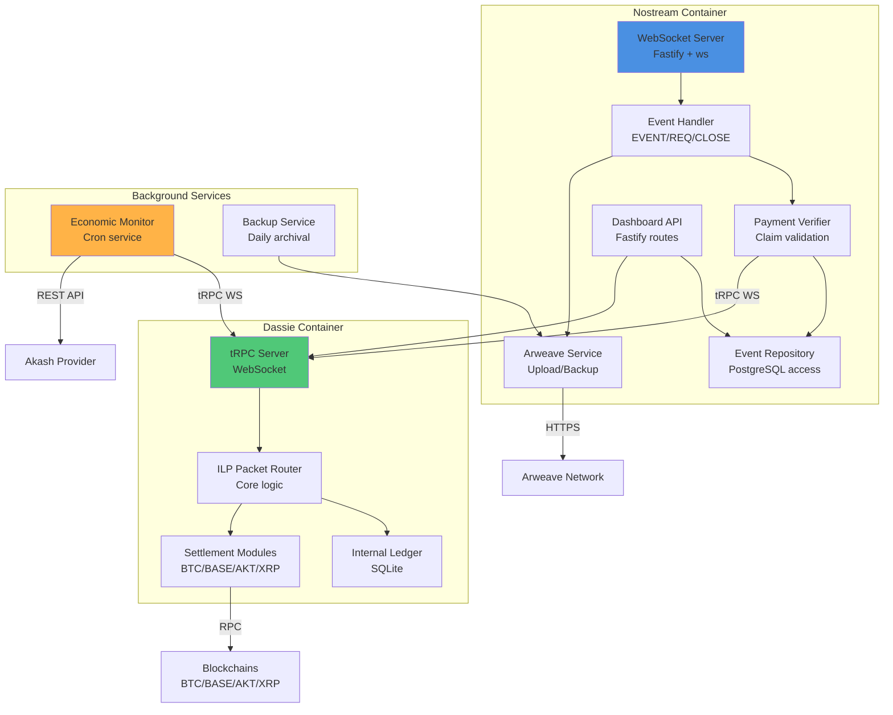

# Backend System Design

## System Components Overview

The backend consists of **three primary subsystems** working in concert:

1. **Nostream Relay Core** (Nostr protocol handler)
2. **Dassie ILP Node** (Payment routing and verification)
3. **Economic Monitor** (Financial automation)

Supporting services:
- **Arweave Integration** (Permanent storage)
- **Dashboard API** (Operator visibility)

## Component Diagram



## Component Specifications

### 1. WebSocket Server (Nostream Entry Point)

**Technology:** Fastify + `ws` library
**Responsibilities:**
- Accept WebSocket connections from Nostr clients
- Parse Nostr protocol messages (EVENT, REQ, CLOSE, AUTH)
- Route messages to appropriate handlers
- Broadcast events to active subscriptions
- Handle connection lifecycle (open, close, error)

**Key Configuration:**
```yaml