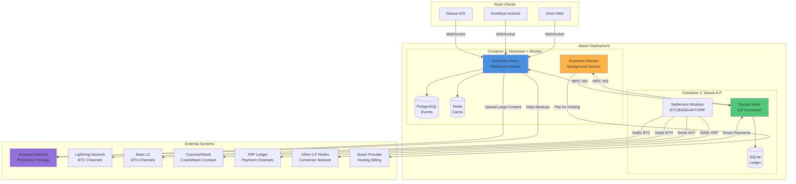

# High Level Architecture

## Technical Summary

The Nostr-ILP Relay is a **dual-process microservices architecture** deploying two specialized containers (Nostream relay + Dassie ILP node) on Akash Network. The system bridges decentralized social networking (Nostr) with cross-ledger micropayments (ILP), enabling a **self-sustaining relay** that accepts payments in multiple cryptocurrencies (BTC, BASE, AKT, XRP) and automatically pays for its own Akash hosting. Core architectural patterns include **event-driven messaging** (Nostr WebSocket), **RPC-based inter-process communication** (tRPC WebSocket), **plugin-based settlement modules** (multi-blockchain support), and **reactive state management** (Dassie signals). The system achieves the PRD goal of economic sustainability by earning revenue from both user micropayments and ILP routing fees, while Arweave permanent storage provides cost-efficient long-term data persistence.

## High Level Overview

**Architectural Style:** **Microservices with Shared Deployment**
- Two independent services (Nostream + Dassie) deployed as separate containers in a single Akash SDL
- Services communicate via localhost WebSocket RPC (tRPC)
- Each service maintains its own data store (PostgreSQL + Redis for Nostream, SQLite for Dassie)

**Repository Structure:** **Dual-Repo (from PRD)**
- Repo 1: `nostream-ilp` - Fork of Nostream with ILP integration
- Repo 2: `dassie-relay` - Fork or upstream Dassie with custom settlement modules
- Repo 3: `cosmos-payment-channels` - New CosmWasm contract

**Service Architecture:** **Two-Process Deployment (from PRD)**
- Container 1: Nostream relay + Economic monitor (combined process)
- Container 2: Dassie ILP node (standalone)
- Both deployed via single Akash SDL (~$2.50-5/month)

**Primary User Interaction Flow:**
1. Nostr client connects via WebSocket → Nostream relay
2. Client publishes EVENT with payment claim in tags
3. Nostream extracts claim → calls Dassie RPC → verifies payment off-chain
4. If valid → Nostream stores event in PostgreSQL + broadcasts to subscribers
5. Economic monitor tracks revenue → converts to AKT → pays Akash provider automatically

**Key Architectural Decisions:**

1. **Inter-Process Communication via WebSocket RPC (not HTTP REST)**
   - Rationale: Leverage Dassie's existing tRPC infrastructure, real-time subscriptions, type-safe API

2. **Off-Chain Payment Verification (not on-chain for every event)**
   - Rationale: Payment channels enable instant verification without blockchain latency or fees

3. **Economic Monitor Co-Located with Nostream**
   - Rationale: Reduces container count (2 vs 3), lower Akash cost, simpler deployment

4. **Arweave for Permanent Storage + Event Backups**
   - Rationale: One-time payment model more sustainable than recurring cloud storage, prevents data loss

5. **Multi-Blockchain Settlement via Plugin Modules**
   - Rationale: Accept payments in any currency, route via ILP connectors, settle natively per blockchain

## High Level Project Diagram

## Architectural and Design Patterns

**1. Event-Driven Architecture**
- Nostr protocol is fundamentally event-driven (EVENT, REQ, CLOSE messages)
- Nostream uses event handlers for each message type
- Dassie uses reactive signals for state changes
- _Rationale:_ Native to both Nostr and Dassie, enables real-time subscriptions, scalable WebSocket model

**2. Repository Pattern (Data Access)**
- Nostream abstracts database access via repositories (`EventRepository`, `SubscriptionRepository`)
- Dassie uses reactive stores for ledger access
- _Rationale:_ Testability (mock repositories), future database migration flexibility, clear separation of data logic from business logic

**3. Plugin Architecture (Settlement Modules)**
- Dassie's `SettlementSchemeModule` interface allows blockchain-agnostic settlement
- Each blockchain (BTC, BASE, AKT, XRP) implements the same interface
- _Rationale:_ Extensibility (add new chains without core changes), modularity (test each independently), aligns with PRD's multi-blockchain requirement

**4. Reactive Programming (Dassie)**
- Dassie uses signals, actors, and computed values for state management
- Real-time balance updates via RPC subscriptions (`subscribeBalance`, `subscribeToLedgerAccount`)
- _Rationale:_ Efficient real-time updates, reduces polling, memory-efficient state propagation

**5. RPC for Inter-Process Communication**
- Nostream → Dassie communication via tRPC over WebSocket
- Type-safe API contract with TypeScript inference
- Bidirectional (queries, mutations, subscriptions)
- _Rationale:_ Leverages existing Dassie RPC server, type safety prevents runtime errors, WebSocket enables real-time subscriptions vs. HTTP polling

**6. Two-Phase Payment Protocol**
- Off-chain payment claims (signed messages) verified before on-chain settlement
- Settlement batched daily or when thresholds reached
- _Rationale:_ Instant verification (<10ms), reduces blockchain transaction costs, aligns with payment channel model (XRP, Lightning)

**7. Hot/Cold Storage Tiers (Arweave)**
- Hot: Recent events + small content in PostgreSQL (fast retrieval)
- Cold: Old events + large content in Arweave (permanent, cheap)
- _Rationale:_ Reduces relay storage costs, permanent data preservation, bundled pricing model (relay fee + storage fee)

**8. Command Query Responsibility Separation (CQRS-lite)**
- Nostream EVENT handler (write path): Payment verification → storage
- Nostream REQ handler (read path): Query filters → cached results
- Dassie ledger (write): ILP packet processing → accounting
- Dassie RPC (read): Query endpoints for monitoring
- _Rationale:_ Optimizes write performance (payment verification) separately from read performance (subscription delivery)

---
