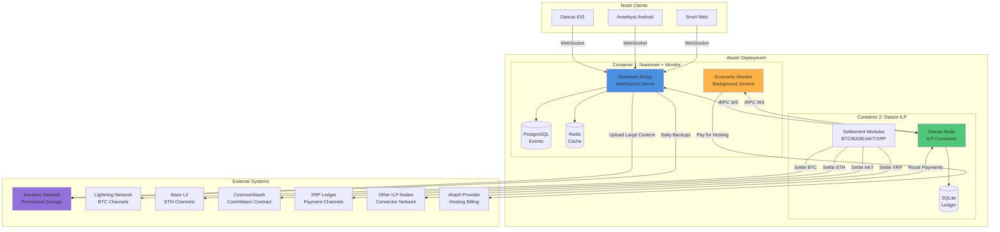

# High Level Architecture

## Technical Summary

The Nostr-ILP Peer Network is a **pure peer-to-peer architecture** where every participant runs a Dassie ILP node with BTP-NIPs protocol support. The system creates a new decentralized network that embeds Nostr events directly inside ILP STREAM packets, achieving **native payment-content coupling** where every message can include micropayments. Each peer operates identically (no client/server distinction), storing events locally in PostgreSQL, routing via ILP's built-in multi-hop protocol, and settling payments through unidirectional channels on Base L2. Core architectural patterns include **BTP-NIPs protocol** (events in ILP packets), **peer-to-peer discovery** (Dassie BNL/KNL + Nostr Kind 32001), **unidirectional payment channels** (sender-only deposits with top-up), and **reactive state management** (Dassie lib-reactive). The system achieves economic sustainability by earning subscription fees from followers while paying minimal Akash hosting costs ($5/month).

## High Level Overview

**Architectural Style:** **Pure Peer-to-Peer Network**
- Every participant runs identical peer node (Dassie + BTP-NIPs + Storage + UI)
- No client/server distinction - everyone is both publisher and relay
- Peers communicate via ILP STREAM (HTTPS) with encrypted BTP-NIPs protocol

**Repository Structure:** **Monorepo**
- Repo 1: `nostream-ilp` - BTP-NIPs implementation, storage layer, UI
- Repo 2: `dassie` - Upstream Dassie (with custom settlement module for Base)
- Repo 3: `cosmos-payment-channels` - Base L2 payment channel contracts

**Service Architecture:** **Integrated Peer Node**
- Container 1: Dassie + BTP-NIPs + PostgreSQL
- Container 2: Web UI (optional, for peer operators)
- Deployed via single Akash SDL (~$5/month)

**Primary Peer Interaction Flow:**
1. Alice follows Bob (Nostr Kind 3 follow list)
2. Alice's node resolves Bob's ILP address (queries Kind 32001)
3. Alice's node discovers Bob via Dassie BNL/KNL
4. Alice opens payment channel with Bob (Base L2, unidirectional)
5. Alice subscribes to Bob via ILP REQ packet (with payment)
6. Bob streams events to Alice via ILP EVENT packets
7. Events propagate multi-hop through network (ILP routing)

**Key Architectural Decisions:**

1. **Inter-Process Communication via WebSocket RPC (not HTTP REST)**
   - Rationale: Leverage Dassie's existing tRPC infrastructure, real-time subscriptions, type-safe API

2. **Off-Chain Payment Verification (not on-chain for every event)**
   - Rationale: Payment channels enable instant verification without blockchain latency or fees

3. **Economic Monitor Co-Located with Nostream**
   - Rationale: Reduces container count (2 vs 3), lower Akash cost, simpler deployment

4. **Arweave for Permanent Storage + Event Backups**
   - Rationale: One-time payment model more sustainable than recurring cloud storage, prevents data loss

5. **Multi-Blockchain Settlement via Plugin Modules**
   - Rationale: Accept payments in any currency, route via ILP connectors, settle natively per blockchain

## High Level Project Diagram

## Architectural and Design Patterns

**1. Event-Driven Architecture**
- Nostr protocol is fundamentally event-driven (EVENT, REQ, CLOSE messages)
- Nostream uses event handlers for each message type
- Dassie uses reactive signals for state changes
- _Rationale:_ Native to both Nostr and Dassie, enables real-time subscriptions, scalable WebSocket model

**2. Repository Pattern (Data Access)**
- Nostream abstracts database access via repositories (`EventRepository`, `SubscriptionRepository`)
- Dassie uses reactive stores for ledger access
- _Rationale:_ Testability (mock repositories), future database migration flexibility, clear separation of data logic from business logic

**3. Plugin Architecture (Settlement Modules)**
- Dassie's `SettlementSchemeModule` interface allows blockchain-agnostic settlement
- Each blockchain (BTC, BASE, AKT, XRP) implements the same interface
- _Rationale:_ Extensibility (add new chains without core changes), modularity (test each independently), aligns with PRD's multi-blockchain requirement

**4. Reactive Programming (Dassie)**
- Dassie uses signals, actors, and computed values for state management
- Real-time balance updates via RPC subscriptions (`subscribeBalance`, `subscribeToLedgerAccount`)
- _Rationale:_ Efficient real-time updates, reduces polling, memory-efficient state propagation

**5. RPC for Inter-Process Communication**
- Nostream → Dassie communication via tRPC over WebSocket
- Type-safe API contract with TypeScript inference
- Bidirectional (queries, mutations, subscriptions)
- _Rationale:_ Leverages existing Dassie RPC server, type safety prevents runtime errors, WebSocket enables real-time subscriptions vs. HTTP polling

**6. Two-Phase Payment Protocol**
- Off-chain payment claims (signed messages) verified before on-chain settlement
- Settlement batched daily or when thresholds reached
- _Rationale:_ Instant verification (<10ms), reduces blockchain transaction costs, aligns with payment channel model (XRP, Lightning)

**7. Hot/Cold Storage Tiers (Arweave)**
- Hot: Recent events + small content in PostgreSQL (fast retrieval)
- Cold: Old events + large content in Arweave (permanent, cheap)
- _Rationale:_ Reduces relay storage costs, permanent data preservation, bundled pricing model (relay fee + storage fee)

**8. Command Query Responsibility Separation (CQRS-lite)**
- Nostream EVENT handler (write path): Payment verification → storage
- Nostream REQ handler (read path): Query filters → cached results
- Dassie ledger (write): ILP packet processing → accounting
- Dassie RPC (read): Query endpoints for monitoring
- _Rationale:_ Optimizes write performance (payment verification) separately from read performance (subscription delivery)

---
