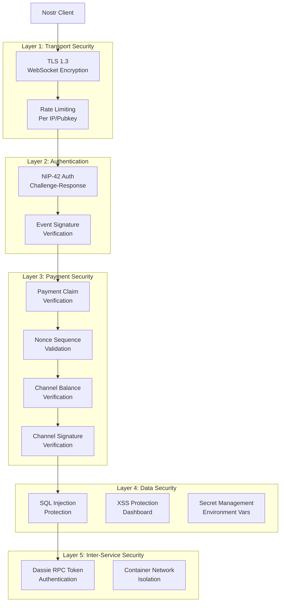

# Security Architecture

## Threat Model

The Nostr-ILP relay faces these primary security threats:

1. **Payment Fraud:**
   - Replay attacks (reuse old payment claims)
   - Double-spending (submit same payment to multiple relays)
   - Signature forgery (fake payment claims)
   - Balance manipulation (claim more than channel balance)

2. **Nostr Protocol Attacks:**
   - Signature verification bypass
   - Event flooding (DoS via spam)
   - Subscription DoS (create infinite subscriptions)
   - Impersonation (forge events from other users)

3. **Infrastructure Attacks:**
   - DDoS against WebSocket endpoint
   - Database injection attacks
   - RPC interception (Nostream ↔ Dassie)
   - Arweave wallet theft

4. **Economic Attacks:**
   - Drain relay's AKT balance (prevent Akash payment)
   - ILP routing manipulation
   - Price oracle manipulation (exchange rate attacks)

## Security Layers



## Authentication & Authorization

### Nostr Client Authentication (NIP-42)

**Purpose:** Prevent abuse by anonymous clients

**Implementation:**
```typescript
// When client connects, send AUTH challenge
function handleNewConnection(ws: WebSocket) {
  const challenge = generateRandomChallenge(); // 32 bytes hex
  ws.metadata = { challenge, authenticated: false };

  send(ws, ['AUTH', challenge]);

  // Timeout if not authenticated within 30 seconds
  setTimeout(() => {
    if (!ws.metadata.authenticated) {
      ws.close(4401, 'Authentication timeout');
    }
  }, 30000);
}

// Verify AUTH response
function handleAuthMessage(ws: WebSocket, authEvent: NostrEvent) {
  // 1. Verify event kind is 22242
  if (authEvent.kind !== 22242) {
    return sendError(ws, 'invalid: wrong event kind for AUTH');
  }

  // 2. Verify challenge tag matches
  const challengeTag = authEvent.tags.find(t => t[0] === 'challenge');
  if (challengeTag?.[1] !== ws.metadata.challenge) {
    return sendError(ws, 'invalid: challenge mismatch');
  }

  // 3. Verify relay tag
  const relayTag = authEvent.tags.find(t => t[0] === 'relay');
  if (relayTag?.[1] !== config.relay.url) {
    return sendError(ws, 'invalid: wrong relay URL');
  }

  // 4. Verify signature
  if (!verifyEventSignature(authEvent)) {
    return sendError(ws, 'invalid: signature verification failed');
  }

  // 5. Mark as authenticated
  ws.metadata.authenticated = true;
  ws.metadata.pubkey = authEvent.pubkey;

  send(ws, ['OK', authEvent.id, true, '']);
}
```

**Enforcement:**
- All EVENT messages require authentication
- REQ messages allowed without auth (public read access)
- Rate limits stricter for unauthenticated connections

### Dashboard Authentication (HTTP Basic Auth)

**Purpose:** Protect operator dashboard from unauthorized access

**Implementation:**
```typescript
// Fastify plugin for dashboard routes
fastify.register(async (instance) => {
  instance.addHook('onRequest', async (request, reply) => {
    const authHeader = request.headers.authorization;

    if (!authHeader || !authHeader.startsWith('Basic ')) {
      reply.code(401).header('WWW-Authenticate', 'Basic realm="Dashboard"');
      throw new Error('Unauthorized');
    }

    const base64Credentials = authHeader.split(' ')[1];
    const credentials = Buffer.from(base64Credentials, 'base64').toString('utf8');
    const [username, password] = credentials.split(':');

    // Verify against environment variables
    const validUsername = process.env.DASHBOARD_USERNAME;
    const validPassword = process.env.DASHBOARD_PASSWORD;

    if (username !== validUsername || password !== validPassword) {
      reply.code(401);
      throw new Error('Invalid credentials');
    }
  });

  instance.get('/dashboard/metrics', handleMetrics);
  instance.get('/dashboard/payments', handlePayments);
  // ... other routes
});
```

**Credentials Storage:**
```bash